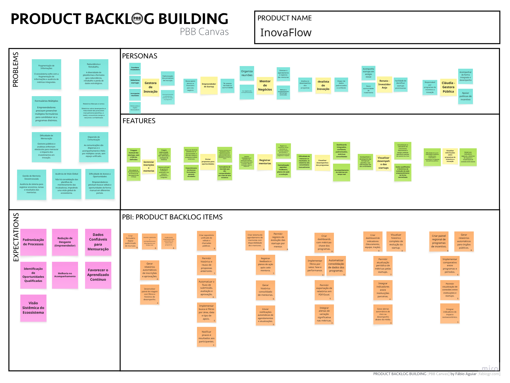

# Product Backlog Building (PBB)

## 1. PBB

O **Product Backlog Building (PBB)** é uma metodologia que auxilia equipes na construção colaborativa do backlog do produto, conectando **processos**, **regras de negócio** e **experiências dos usuários** em uma visão integrada.  
Diferente da simples listagem de tarefas, o PBB organiza o backlog com base em **fluxos de valor**, permitindo identificar gaps, entender expectativas das personas e transformar necessidades reais em **histórias de usuário claras e priorizadas**.

Ele é especialmente útil em ambientes complexos, como ecossistemas de inovação, onde múltiplos atores (empreendedores, gestores, mentores, investidores e governo) precisam se alinhar em torno dos mesmos objetivos.

---

## 2. Contexto

Com base no estudo de caso da **InovaHub**, o ecossistema nacional de inovação enfrenta desafios decorrentes da **fragmentação de informações** e da ausência de uma plataforma integrada. Entre os principais problemas identificados estão:

### **Desorganização de processos**
- Cada instituição usa sistemas próprios para gerenciar startups, mentorias, editais e eventos.  
- Empreendedores precisam preencher múltiplos formulários e acessar diversas plataformas diferentes.  
- Mentores têm dificuldade para acompanhar o progresso das startups de forma estruturada.

### **Falta de integração e visibilidade**
- Indicadores são monitorados em planilhas isoladas e não há consolidação dos dados.  
- Gestores públicos e analistas enfrentam inconsistências e lentidão na geração de relatórios.  
- Investidores não possuem canais estruturados para acessar métricas confiáveis sobre startups.

### **Impactos negativos para todos os atores**
- Redundância de dados e retrabalho.  
- Dificuldade para mensurar impacto dos programas de inovação.  
- Falta de um ambiente centralizado que unifique inscrição, acompanhamento, métricas e conexões.

A proposta do PBB é **estruturar e entender esses fluxos**, identificando funcionalidades essenciais para construir uma **plataforma integrada de inovação e empreendedorismo**, que atenda às necessidades de todos os envolvidos.

---

## 3. Canvas PBB

Disponível em: https://miro.com/app/board/uXjVJDF_XEY=/?moveToWidget=3458764647714443252&cot=14

---

## 4. User Stories, Critérios de Aceitação e BDD 

---

## US 01 — Criar Edital

**Funcionalidade:** Criar Edital  

**User Story:**  
Eu como Gestora de Inovação posso criar e configurar editais de incubação e aceleração para formalizar e iniciar novos programas de apoio a empreendedores.

**Critério de Aceitação (CA):**  
O edital deve ser salvo no status **"Rascunho"** após o preenchimento e salvamento dos campos obrigatórios.

**Critérios BDD:**  
CENÁRIO: Criação de um novo Edital de Incubação.  
DADO QUE estou na área de gestão de editais e acessei a opção "Novo Edital"  
QUANDO preencho todos os campos obrigatórios (título, tipo, datas, critérios) e salvo  
ENTÃO o sistema registra o Edital no status **"Rascunho"** e me exibe a tela de detalhes.

---

## US 02 — Publicar Edital

**Funcionalidade:** Publicar Edital  

**User Story:**  
Eu como Gestora posso publicar editais criados previamente para disponibilizá-los publicamente aos empreendedores.

**Critério de Aceitação (CA):**  
O edital deve mudar para o status **"Aberto"** e ser exibido na área pública da plataforma após a confirmação de publicação.

**Critérios BDD:**  
CENÁRIO: Publicação de um Edital Rascunho.  
DADO QUE existe um Edital no status "Rascunho" e com todas as configurações necessárias  
QUANDO eu clico no botão "Publicar Edital" e confirmo a ação  
ENTÃO o status do Edital muda para **"Aberto"** e ele se torna visível na área pública.

---

## US 03 — Buscar Editais

**Funcionalidade:** Buscar Editais  

**User Story:**  
Eu como Empreendedor posso buscar e filtrar editais por área, data e tipo para encontrar oportunidades relevantes para minha startup.

**Critério de Aceitação (CA):**  
A aplicação de filtros deve exibir apenas os editais que correspondam a todas as condições selecionadas.

**Critérios BDD:**  
CENÁRIO: Busca e Filtragem de Editais.  
DADO QUE estou na página de busca e existem vários editais abertos  
QUANDO aplico o filtro "Área de Tecnologia" e "Tipo Aceleração"  
ENTÃO apenas os editais que atendem a ambos os filtros são exibidos.

---

## US 04 — Submeter Inscrição

**Funcionalidade:** Submeter Inscrição  

**User Story:**  
Eu como Empreendedor posso submeter a inscrição da minha startup em um edital para participar de programas de aceleração.

**Critério de Aceitação (CA):**  
O empreendedor deve receber uma confirmação, e o status da inscrição deve mudar para **"Pendente de Avaliação"** após o envio.

**Critérios BDD:**  
CENÁRIO: Submissão de Inscrição em Edital.  
DADO QUE o edital está no período de inscrições e o perfil da startup está completo  
QUANDO preencho o formulário e clico em "Enviar"  
ENTÃO recebo confirmação, e o status da inscrição torna-se **"Pendente de Avaliação"**.

---

## US 05 — Cadastrar Perfil da Startup

**Funcionalidade:** Cadastrar Perfil  

**User Story:**  
Eu como Empreendedor posso cadastrar o perfil da minha startup para reutilizar essas informações em futuras inscrições.

**Critério de Aceitação (CA):**  
Após o cadastro, os dados básicos devem preencher automaticamente novos formulários de inscrição.

**Critérios BDD:**  
CENÁRIO: Cadastro Inicial da Startup.  
DADO QUE não tenho um perfil cadastrado  
QUANDO insiro os dados básicos e salvo  
ENTÃO o sistema cria o perfil e passa a preencher automaticamente os formulários futuros.

---

## US 06 — Atualizar KPIs

**Funcionalidade:** Atualizar KPIs  

**User Story:**  
Eu como Empreendedor posso atualizar os KPIs da minha startup para acompanhar evolução e demonstrar resultados.

**Critério de Aceitação (CA):**  
O dashboard deve ser atualizado com os novos valores, e o histórico deve ser mantido.

**Critérios BDD:**  
CENÁRIO: Atualização Mensal de KPIs.  
DADO QUE o mês foi encerrado  
QUANDO insiro novos valores e salvo  
ENTÃO o dashboard é atualizado e o histórico registrado.

---

## US 07 — Autenticação e Perfis

**Funcionalidade:** Login e Perfis  

**User Story:**  
Eu como Usuária da Plataforma posso realizar login para acessar o sistema conforme meu perfil.

**Critério de Aceitação (CA):**  
O usuário deve ser redirecionado ao Dashboard correspondente ao perfil.

**Critérios BDD:**  
CENÁRIO: Login bem-sucedido.  
DADO QUE estou na tela de login  
QUANDO insiro credenciais válidas  
ENTÃO sou redirecionada ao Dashboard do meu perfil.

---

## US 08 — Cadastrar Perfil do Mentor

**Funcionalidade:** Perfil de Mentor  

**User Story:**  
Eu como Mentor posso cadastrar minhas especialidades e disponibilidade para ser encontrado.

**Critério de Aceitação (CA):**  
O perfil deve ser marcado como **"Completo"** após preencher especialidades e disponibilidade.

**Critérios BDD:**  
CENÁRIO: Preenchimento do Perfil de Mentor.  
DADO QUE tenho cadastro inicial  
QUANDO informo especialidades e disponibilidade  
ENTÃO meu perfil torna-se **"Completo"** e aparece na busca.

---

## US 09 — Solicitar Mentoria

**Funcionalidade:** Solicitação de Mentoria  

**User Story:**  
Eu como Empreendedor posso solicitar uma mentoria para receber orientação.

**Critério de Aceitação (CA):**  
O Mentor deve ser notificado, e o agendamento deve ficar com status **"Pendente"**.

**Critérios BDD:**  
CENÁRIO: Solicitação de Agendamento.  
DADO QUE encontrei mentor disponível  
QUANDO envio solicitação  
ENTÃO o Mentor recebe notificação e o agendamento aparece como **"Pendente"**.

---

## US 10 — Agendar Mentoria

**Funcionalidade:** Agendar Mentoria  

**User Story:**  
Eu como Mentor posso agendar encontros para organizar o cronograma de orientações.

**Critério de Aceitação (CA):**  
Um evento deve ser criado no calendário, e a startup deve ser notificada.

**Critérios BDD:**  
CENÁRIO: Agendamento de Mentoria.  
DADO QUE estou visualizando o perfil da startup  
QUANDO seleciono data e hora e envio convite  
ENTÃO o evento é criado e a startup recebe notificação.

---

## US 11 — Registrar Feedback

**Funcionalidade:** Feedback de Mentoria  

**User Story:**  
Eu como Mentor posso registrar feedbacks das mentorias.

**Critério de Aceitação (CA):**  
O feedback deve ser salvo e acessível pela startup.

**Critérios BDD:**  
CENÁRIO: Registro de Feedback.  
DADO QUE a mentoria foi concluída  
QUANDO acesso o registro e adiciono feedback  
ENTÃO a startup pode visualizar o histórico.

---

## US 12 — Reaproveitamento de Dados

**Funcionalidade:** Pré-preenchimento  

**User Story:**  
Eu como Gestora posso reaproveitar informações já fornecidas pelas startups para reduzir retrabalho.

**Critério de Aceitação (CA):**  
Os formulários devem vir pré-preenchidos com dados básicos da startup.

**Critérios BDD:**  
CENÁRIO: Pré-preenchimento.  
DADO QUE a startup tem perfil cadastrado  
QUANDO inicia nova inscrição  
ENTÃO os dados básicos aparecem automaticamente.

---

## US 13 — Avaliar Inscrições

**Funcionalidade:** Avaliações  

**User Story:**  
Eu como Gestora posso avaliar inscrições com base em critérios padronizados.

**Critério de Aceitação (CA):**  
A avaliação deve ser salva, contribuir na pontuação e registrar comentário.

**Critérios BDD:**  
CENÁRIO: Avaliação de Inscrição.  
DADO QUE estou avaliando uma inscrição  
QUANDO preencho notas e comentários  
ENTÃO minha avaliação é registrada e compõe a pontuação final.

---

## US 14 — Relatórios Automáticos

**Funcionalidade:** Gerar Relatórios  

**User Story:**  
Eu como Gestora posso gerar relatórios automáticos do programa.

**Critério de Aceitação (CA):**  
Um documento PDF deve ser gerado com KPIs consolidados.

**Critérios BDD:**  
CENÁRIO: Relatório de Performance.  
DADO QUE existem dados de startups  
QUANDO solicito relatório em PDF  
ENTÃO um documento é gerado com KPIs consolidados.

---

## US 15 — Visualizar Portfólio

**Funcionalidade:** Portfólio de Startups  

**User Story:**  
Eu como Gestora posso visualizar o portfólio das startups da incubadora.

**Critério de Aceitação (CA):**  
A lista deve exibir status, programa e KPIs atualizados.

**Critérios BDD:**  
CENÁRIO: Visualização do Portfólio.  
DADO QUE estou na área de Portfólio  
QUANDO acesso a lista  
ENTÃO visualizo startups com status e KPIs atualizados.

---

## US 16 — Buscar Mentores

**Funcionalidade:** Busca de Mentores  

**User Story:**  
Eu como Empreendedor posso buscar mentores por área e experiência.

**Critério de Aceitação (CA):**  
A busca deve retornar apenas mentores compatíveis com a área filtrada.

**Critérios BDD:**  
CENÁRIO: Busca de Mentor de Finanças.  
DADO QUE estou na busca  
QUANDO aplico filtro "Finanças"  
ENTÃO apenas mentores com essa especialidade aparecem.

---

## US 17 — Dashboard Ecossistema

**Funcionalidade:** Dashboard Regional  

**User Story:**  
Eu como Gestora Pública posso visualizar indicadores regionais consolidados.

**Critério de Aceitação (CA):**  
O dashboard deve mostrar KPIs chave do ecossistema.

**Critérios BDD:**  
CENÁRIO: Acesso ao Dashboard Regional.  
DADO QUE realizei login como Gestora Pública  
QUANDO acesso a tela principal  
ENTÃO vejo o dashboard consolidado.

---

## US 18 — Integrar Indicadores

**Funcionalidade:** Integração de Dados  

**User Story:**  
Eu como Gestora Pública posso integrar indicadores de diversas fontes.

**Critério de Aceitação (CA):**  
Os dados do parceiro devem ser processados e incluídos nas análises comparativas.

**Critérios BDD:**  
CENÁRIO: Integração de Nova Fonte.  
DADO QUE possuo fonte externa  
QUANDO configuro API e mapeio campos  
ENTÃO os dados passam a compor análises comparativas.

---

## US 19 — Histórico de Mentorias

**Funcionalidade:** Histórico  

**User Story:**  
Eu como Mentor posso visualizar histórico de mentorias realizadas.

**Critério de Aceitação (CA):**  
A seção deve exibir encontros, feedbacks e ações definidas.

**Critérios BDD:**  
CENÁRIO: Consulta ao Histórico.  
DADO QUE estou no perfil da startup  
QUANDO acesso "Histórico de Mentorias"  
ENTÃO vejo a lista completa de encontros.

---

## US 20 — Alertas de Risco

**Funcionalidade:** Alertas Inteligentes  

**User Story:**  
Eu como Gestora de Inovação posso receber alertas de risco baseados em dados críticos.

**Critério de Aceitação (CA):**  
A gestora deve receber notificação imediata ao detectar queda crítica em KPIs.

**Critérios BDD:**  
CENÁRIO: Alerta de Risco.  
DADO QUE um KPI teve queda crítica  
QUANDO regra de risco é detectada  
ENTÃO recebo notificação imediata.

---

## US 21 — Buscar Startups

**Funcionalidade:** Busca de Startups  

**User Story:**  
Eu como Investidor posso buscar startups por setor e maturidade.

**Critério de Aceitação (CA):**  
A busca deve retornar apenas startups que atendam aos filtros aplicados.

**Critérios BDD:**  
CENÁRIO: Busca de Oportunidades.  
DADO QUE estou na prospecção  
QUANDO aplico filtros "Fintech" e "Série A"  
ENTÃO vejo somente startups compatíveis.

---

## US 22 — Histórico de Evolução

**Funcionalidade:** Gráfico Histórico  

**User Story:**  
Eu como Investidor posso visualizar evolução histórica de KPIs.

**Critério de Aceitação (CA):**  
A startup deve exibir gráficos históricos de KPIs principais dos últimos 12 meses.

**Critérios BDD:**  
CENÁRIO: Visualização da Evolução.  
DADO QUE estou analisando uma startup  
QUANDO abro gráfico de MRR  
ENTÃO vejo série histórica dos últimos 12 meses.

---

## US 23 — Calendário de Eventos

**Funcionalidade:** Calendário  

**User Story:**  
Eu como Empreendedor posso visualizar calendário com editais e eventos relevantes.

**Critério de Aceitação (CA):**  
O calendário deve exibir prazos de editais e datas de eventos.

**Critérios BDD:**  
CENÁRIO: Consulta ao Calendário.  
DADO QUE estou no dashboard  
QUANDO abro o calendário  
ENTÃO vejo editais e eventos consolidados.

---

## US 24 — Registrar Networking

**Funcionalidade:** Networking  

**User Story:**  
Eu como Mentor posso registrar interações de networking realizadas em eventos.

**Critério de Aceitação (CA):**  
As interações devem ser salvas com nome, empresa e contexto.

**Critérios BDD:**  
CENÁRIO: Registro de Networking.  
DADO QUE participei de um evento  
QUANDO registro uma nova interação  
ENTÃO ela é salva no histórico vinculada ao evento.

---

## US 25 — Matchmaking

**Funcionalidade:** Recomendações Automáticas  

**User Story:**  
Eu como Investidor posso receber recomendações automáticas de startups alinhadas ao meu perfil.

**Critério de Aceitação (CA):**  
O investidor deve receber notificação por email com resumo da startup recomendada.

**Critérios BDD:**  
CENÁRIO: Recebimento de Recomendação.  
DADO QUE meu perfil está configurado  
QUANDO uma nova startup correspondente se cadastra  
ENTÃO recebo um email automático com o resumo.

---

## US 26 — Feedbacks de Eventos

**Funcionalidade:** Coleta de Feedback  

**User Story:**  
Eu como Gestora de Inovação posso coletar feedbacks de participantes após eventos.

**Critério de Aceitação (CA):**  
Os participantes devem receber link da pesquisa e as respostas devem ser exibidas no painel da gestora.

**Critérios BDD:**  
CENÁRIO: Envio de Pesquisa.  
DADO QUE um evento foi concluído  
QUANDO aciono "Enviar Pesquisa de Feedback"  
ENTÃO todos os participantes recebem o link e respostas são coletadas.

---

## US 27 — Relatórios de Impacto

**Funcionalidade:** Relatórios de Impacto  

**User Story:**  
Eu como Gestora Pública posso gerar relatórios consolidados do ecossistema para justificar investimentos.

**Critério de Aceitação (CA):**  
O relatório deve mostrar indicadores regionais e retorno sobre investimento público.

**Critérios BDD:**  
CENÁRIO: Geração de Relatório de Impacto.  
DADO QUE indicadores estão consolidados  
QUANDO solicito relatório anual  
ENTÃO um documento é gerado mostrando crescimento e ROI do ecossistema.

---

