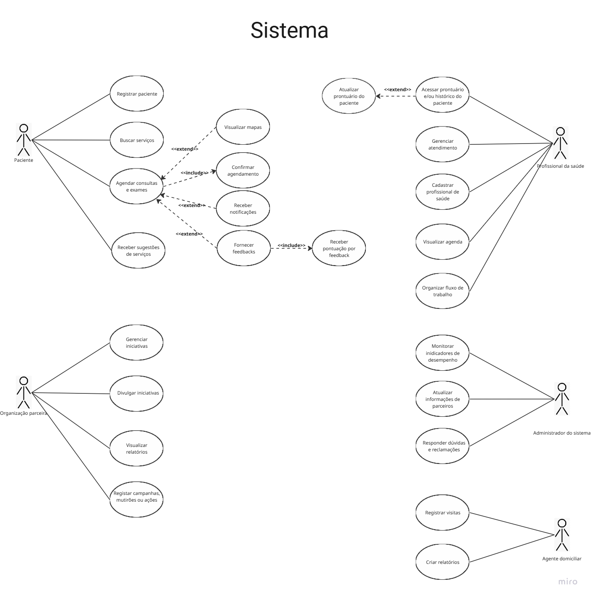

# 1. Diagrama de Caso de Uso

O diagrama de caso de uso do **ConnectCare** representa as principais interações entre os diferentes tipos de usuários (pacientes, profissionais de saúde, agentes comunitários, organizações parceiras e administradores) e as funcionalidades essenciais do sistema. Ele serve como uma visão geral das capacidades do sistema e das responsabilidades de cada ator.

---

# 2. Contexto 

O **ConnectCare** é uma plataforma criada para melhorar o acesso à saúde em comunidades vulneráveis, como a Vila Esperança — um local remoto com infraestrutura limitada, escassez de profissionais de saúde e baixa disponibilidade de internet. Apesar dessas dificuldades, a comunidade possui forte senso de colaboração, o que possibilitou a criação de uma solução voltada para ampliar o alcance dos serviços médicos locais.

A missão do ConnectCare é **reduzir desigualdades no acesso à saúde**, oferecendo funcionalidades que auxiliem tanto pacientes quanto profissionais, organizações parceiras e administradores.  
Ele facilita o agendamento de consultas, acompanhamento de prontuários, campanhas de saúde e monitoramento de indicadores sociais e operacionais.

### Objetivo Principal
Garantir acesso facilitado e eficiente a serviços de saúde para comunidades vulneráveis, promovendo impacto social positivo por meio da tecnologia.

### Objetivos Específicos
- Expandir o acesso aos serviços, permitindo localizar e agendar consultas facilmente.
- Automatizar processos de atendimento, como filas e prontuários digitais.
- Divulgar e promover campanhas de saúde comunitária.
- Fortalecer a comunicação entre pacientes e profissionais.
- Monitorar impacto social e operacional por meio de métricas e relatórios.

### Objetivos do Aplicativo
- Mapear e listar serviços de saúde próximos.
- Facilitar consultas online e presenciais.
- Gerenciar dados médicos e prontuários.
- Apoiar campanhas comunitárias.
- Gerar relatórios de impacto.

### Resultados Esperados
- Redução no tempo de espera por consultas.
- Maior engajamento em campanhas de saúde.
- Dados estruturados para decisões estratégicas.

---

# 3. Diagrama de Caso de Uso

[Acesse o diagrama de caso de uso no Miro](https://miro.com/app/board/uXjVJDF_XEY=/?moveToWidget=3458764649842494919&cot=14)

# 4. Especificações de Caso de Uso

## 1. Agendar Consultas e Exames

### 1.1 Breve Descrição
Este caso de uso permite ao paciente localizar unidades de saúde e agendar atendimentos (consultas ou exames) com base em filtros como localização e disponibilidade. O sistema verifica a agenda em tempo real, registra a solicitação e gera uma confirmação automática para o usuário.

### 1.2 Atores
• Paciente

### 2. Fluxo de Eventos

#### 2.1 Fluxo Principal
Este caso de uso é iniciado quando o paciente escolhe a opção “Buscar Serviços de Saúde”.

2.1.1 O sistema apresenta a interface de busca com as seguintes opções:
• filtros por tipo de atendimento;
• filtros por localização geográfica [RN01];
• visualizar mapa interativo [FA01].
2.1.2 O paciente define os filtros desejados e confirma a busca.
2.1.3 O sistema apresenta a lista de unidades de saúde e horários disponíveis.
2.1.4 O paciente seleciona o horário e a unidade desejada.
2.1.5 O sistema apresenta o resumo do agendamento (local, data, profissional).
2.1.6 O paciente confirma o agendamento.
2.1.7 O sistema verifica a disponibilidade final da vaga [RN02][FE01].
2.1.8 O sistema registra o agendamento, envia notificação de confirmação e atualiza a agenda da unidade [RN03].
2.1.9 O sistema exibe mensagem de agendamento realizado com sucesso.
2.1.10 O caso de uso é encerrado.

#### 2.2 Fluxos Alternativos

2.2.1 [FA01] Visualizar Mapa Interativo
No passo 2.1.1, o paciente optou por visualizar os serviços no mapa.
2.2.1.1 O sistema exibe o mapa da região com pinos indicando as unidades de saúde próximas (Extensão: Visualizar Mapas).
2.2.1.2 O paciente seleciona um pino no mapa.
2.2.1.3 O sistema apresenta os detalhes da unidade selecionada.
(Retorna ao passo 2.1.4).

#### 2.3 Fluxos de Exceção

2.3.1 [FE01] Horário Indisponível
No passo 2.1.7, o sistema identifica que o horário selecionado foi ocupado por outro usuário simultaneamente. O sistema apresenta mensagem informando a indisponibilidade e solicita nova seleção. O sistema retorna ao passo 2.1.3.

### 3. Requisitos Especiais
3.1 Este caso de uso deve funcionar em modo simplificado para conexões de baixa velocidade (low-end).

### 4. Regras de Negócio

4.1.1 [RN01] Sugestão por Geolocalização
O sistema deve priorizar e sugerir unidades de saúde num raio de até 5km da localização atual do paciente.

4.1.2 [RN02] Bloqueio de Concorrência
O sistema deve garantir o bloqueio atômico do horário no momento da confirmação para evitar *overbooking*.

4.1.3 [RN03] Notificação Obrigatória
Todo agendamento confirmado deve gerar uma notificação (push ou SMS) contendo data, horário, local e lista de documentos necessários.

### 5. Precondições
5.1 O paciente deve estar autenticado no sistema.

### 6. Pós-condições
6.1 O agendamento deve constar na agenda da unidade de saúde e no histórico do paciente.

### 7. Pontos de Extensão
7.1 No passo 2.1.1 este caso de uso pode ser estendido por “Visualizar Mapas”.
7.2 No passo 2.1.8 este caso de uso pode ser estendido por “Receber Notificações”.

---

## 2. Atualizar Prontuário do Paciente

### 1.1 Breve Descrição
Este caso de uso permite ao profissional de saúde registrar diagnósticos, prescrições, resultados de exames e orientações no histórico digital do paciente. As informações são sincronizadas para permitir continuidade no tratamento e acesso por outros profissionais autorizados.

### 1.2 Atores
• Profissional de Saúde

### 2. Fluxo de Eventos

#### 2.1 Fluxo Principal
Este caso de uso é iniciado quando o profissional de saúde seleciona um atendimento em andamento na sua agenda.

2.1.1 O sistema apresenta os dados básicos do paciente.
2.1.2 O profissional solicita acesso aos detalhes clínicos do paciente.
2.1.3 O sistema exibe o histórico médico completo (Extensão: Acessar Prontuário e/ou Histórico).
2.1.4 O profissional insere as novas informações clínicas (diagnóstico, prescrição, orientações) [RN01].
2.1.5 O profissional confirma a atualização do prontuário.
2.1.6 O sistema valida os dados inseridos [FE01].
2.1.7 O sistema grava as alterações no prontuário digital e gera log de auditoria [RN02].
2.1.8 O sistema exibe mensagem de sucesso.
2.1.9 O caso de uso é encerrado.

#### 2.2 Fluxos Alternativos
Não se aplica.

#### 2.3 Fluxos de Exceção

2.3.1 [FE01] Dados Clínicos Inválidos
No passo 2.1.6, o sistema identifica campos obrigatórios em branco ou dados inconsistentes. O sistema apresenta mensagem de erro e destaca os campos. O sistema retorna ao passo 2.1.4.

2.3.2 [FE02] Falha de Sincronização
No passo 2.1.7, o sistema não consegue conexão com o servidor central. O sistema salva os dados localmente (cache criptografado) e informa que a sincronização ocorrerá posteriormente. O caso de uso é encerrado.

### 3. Requisitos Especiais
3.1 O sistema deve garantir conformidade com a LGPD e sigilo médico.

### 4. Regras de Negócio

4.1.1 [RN01] Registro de Medicamentos
Ao prescrever medicamentos, o sistema deve permitir a seleção a partir de uma base de dados padronizada (ex: Rename).

4.1.2 [RN02] Rastreabilidade da Alteração
Toda atualização no prontuário deve registrar o ID do profissional, data, hora e geolocalização da ação.

### 5. Precondições
5.1 O profissional de saúde deve estar autenticado e vinculado a uma unidade de saúde.
5.2 O atendimento deve estar com status "Em andamento".

### 6. Pós-condições
6.1 O prontuário do paciente reflete as novas informações clínicas.

### 7. Pontos de Extensão
7.1 No passo 2.1.3 este caso de uso pode ser estendido por “Acessar Prontuário e/ou Histórico do Paciente”.

---

## 3. Registrar Campanhas, Mutirões ou Ações

### 1.1 Breve Descrição
Este caso de uso permite às organizações parceiras cadastrarem iniciativas de saúde comunitária (como vacinação ou palestras). O cadastro define o público-alvo, local e datas, permitindo que o sistema divulgue a ação de forma segmentada para a comunidade.

### 1.2 Atores
• Organização Parceira

### 2. Fluxo de Eventos

#### 2.1 Fluxo Principal
Este caso de uso é iniciado quando a organização parceira seleciona a opção “Nova Iniciativa”.

2.1.1 O sistema apresenta o formulário de cadastro de iniciativas.
2.1.2 A organização preenche os dados da campanha (título, descrição, local, data) [RN01].
2.1.3 A organização define os critérios de segmentação do público-alvo [RN02].
2.1.4 A organização confirma o registro.
2.1.5 O sistema valida as informações e a elegibilidade da organização [FE01].
2.1.6 O sistema registra a campanha e agenda o disparo de divulgações.
2.1.7 O sistema exibe mensagem de campanha criada com sucesso.
2.1.8 O caso de uso é encerrado.

#### 2.2 Fluxos Alternativos
Não se aplica.

#### 2.3 Fluxos de Exceção

2.3.1 [FE01] Localização Inválida
No passo 2.1.5, o sistema não consegue validar o endereço informado para o mutirão. O sistema solicita correção. O sistema retorna ao passo 2.1.2.

### 3. Requisitos Especiais
Não se aplica.

### 4. Regras de Negócio

4.1.1 [RN01] Período de Vigência
A data de fim da campanha não pode ser anterior à data de início, nem anterior à data atual.

4.1.2 [RN02] Segmentação de Público
O sistema deve permitir filtrar o público por: faixa etária, gênero, região de moradia e condições de saúde pré-existentes (ex: hipertensos).

### 5. Precondições
5.1 A organização parceira deve ter cadastro ativo e validado pelo Administrador.

### 6. Pós-condições
6.1 A campanha torna-se visível para os usuários que atendem aos critérios de segmentação.

### 7. Pontos de Extensão
Não se aplica.

---

## 4. Fornecer Feedbacks

### 1.1 Breve Descrição
Este caso de uso permite ao paciente avaliar a qualidade do atendimento recebido e a usabilidade do aplicativo. Ao concluir a avaliação, o usuário é recompensado com pontos de fidelidade, incentivando o engajamento contínuo.

### 1.2 Atores
• Paciente

### 2. Fluxo de Eventos

#### 2.1 Fluxo Principal
Este caso de uso é iniciado automaticamente após a conclusão de um agendamento ou acessado via histórico.

2.1.1 O sistema apresenta a tela de avaliação referente ao serviço utilizado.
2.1.2 O paciente atribui uma nota (escala de 1 a 5) para o profissional/unidade.
2.1.3 O paciente insere comentários textuais (opcional).
2.1.4 O paciente confirma o envio do feedback.
2.1.5 O sistema registra a avaliação e calcula a pontuação de recompensa [RN01].
2.1.6 O sistema credita os pontos no perfil do usuário (Inclusão: Receber Pontuação por Feedback).
2.1.7 O sistema exibe mensagem de agradecimento e saldo atualizado de pontos.
2.1.8 O caso de uso é encerrado.

#### 2.2 Fluxos Alternativos
Não se aplica.

#### 2.3 Fluxos de Exceção
Não se aplica.

### 3. Requisitos Especiais
3.1 A interface deve ser gamificada para estimular a interação.

### 4. Regras de Negócio

4.1.1 [RN01] Cálculo de Recompensa
Cada avaliação completa deve gerar 50 pontos de fidelidade para o paciente. O limite diário é de 200 pontos.

4.1.2 [RN02] Monitoramento de Qualidade
Notas inferiores a 3 devem gerar um alerta automático para o Administrador do sistema.

### 5. Precondições
5.1 O paciente deve ter concluído um atendimento.

### 6. Pós-condições
6.1 A avaliação compõe os indicadores de desempenho da unidade e o saldo de pontos do paciente é incrementado.

### 7. Pontos de Extensão
Não se aplica.

---

## 5. Registrar Paciente

### 1.1 Breve Descrição
Este caso de uso permite que um novo usuário (morador da comunidade) crie seu perfil no ConnectCare. O registro coleta dados pessoais e condições básicas de saúde para permitir a triagem e o acesso aos serviços da plataforma.

### 1.2 Atores
• Paciente (Usuário não logado)

### 2. Fluxo de Eventos

#### 2.1 Fluxo Principal
Este caso de uso é iniciado quando o usuário seleciona a opção “Criar Conta” na tela inicial.

2.1.1 O sistema solicita os dados obrigatórios: Nome, CPF, Data de Nascimento e Endereço.
2.1.2 O usuário informa os dados solicitados.
2.1.3 O sistema solicita informações básicas de saúde (alergias, condições crônicas).
2.1.4 O usuário preenche ou seleciona “Não possuo/Não sei informar”.
2.1.5 O usuário cria uma senha de acesso e confirma o cadastro.
2.1.6 O sistema valida a unicidade do CPF [FE01].
2.1.7 O sistema cria o perfil do paciente e gera o prontuário digital inicial [RN01].
2.1.8 O sistema exibe mensagem de boas-vindas e redireciona para a tela principal.
2.1.9 O caso de uso é encerrado.

#### 2.2 Fluxos Alternativos
Não se aplica.

#### 2.3 Fluxos de Exceção

2.3.1 [FE01] Usuário Já Cadastrado
No passo 2.1.6, o sistema identifica que o CPF informado já possui conta ativa. O sistema informa que o usuário já existe e oferece a opção de recuperação de senha. O sistema retorna à tela de login.

### 3. Requisitos Especiais
3.1 O processo de cadastro deve ser otimizado para digitação mínima.

### 4. Regras de Negócio

4.1.1 [RN01] Criação de Prontuário
O cadastro do usuário deve gerar automaticamente um ID único de prontuário, vinculado ao CPF, para uso futuro pelos profissionais de saúde.

### 5. Precondições
5.1 O usuário não deve estar logado.

### 6. Pós-condições
6.1 O usuário possui credenciais de acesso e pode utilizar as funcionalidades do sistema.

### 7. Pontos de Extensão
Não se aplica.