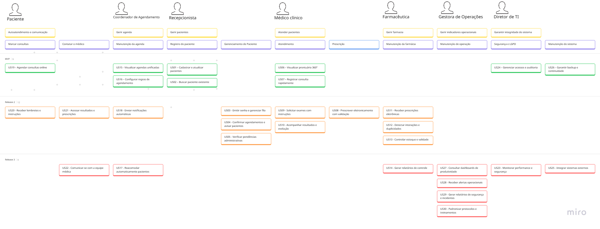

# User Story Mapping — HealthConnect

---

## 1. User Story Mapping

O **User Story Mapping (USM)** é uma técnica colaborativa e visual que organiza a jornada do usuário em níveis:  
- **Atividades** (objetivos de alto nível do usuário)  
- **Tarefas** (ações que compõem cada atividade)  
- **User Stories** (funcionalidades que o sistema precisa oferecer)

O USM ajuda as equipes a:  
- Entender o fluxo ponta a ponta da experiência do usuário  
- Priorizar funcionalidades com base em valor  
- Criar releases coerentes  
- Identificar dependências e lacunas  
- Visualizar o produto de forma integrada

---

## 2. Contexto 

A HealthConnect é uma rede de clínicas e hospitais distribuídos pelo Brasil.  
Mesmo com grande atuação, seus processos digitais são **fragmentados**, redundantes e frágeis — prejudicando **pacientes, médicos, recepcionistas, farmácias, agendamento e gestão clínica**.

Os problemas principais incluem:

### **Sistemas Desconectados**
- Prontuários e exames espalhados em sistemas locais  
- Falta de interoperabilidade entre unidades  
- Profissionais precisam reconstruir o histórico do paciente manualmente  

### **Agendamentos Desalinhados**
- Módulos independentes geram filas, faltas e reagendamentos  
- Pacientes precisam ligar para remarcar  
- Ausência de lembretes automáticos  

### **Prescrições e Farmácia Sem Integração**
- Receitas manuscritas, ilegíveis e sem checagem de interação  
- Farmácia redigita tudo manualmente  
- Sem alertas de dose, validade ou duplicidade  

### **Comunicação Fragmentada com o Paciente**
- Mistura de telefonemas, e-mails e apps diversos  
- Paciente não tem um único canal para:  
  - consultas  
  - exames  
  - prescrições  
  - instruções pós-atendimento  

### **Problemas de Dados e Conformidade**
- Auditorias manuais  
- Falta de trilhas de auditoria  
- Risco de não conformidade com a LGPD  

### **Parcerias externas desconectadas**
- Laboratórios, operadoras e reguladores têm fluxos paralelos  
- Nada reflete a jornada contínua do paciente  

---

## 3. User Story Mapping (USM)

[Acessar USM no Miro](https://miro.com/app/board/uXjVJDF_XEY=/?moveToWidget=3458764647793097261&cot=14)

---

# User Stories 

---

## US01 — Cadastrar e atualizar pacientes

**User Story:**  
Como secretária, eu quero cadastrar ou atualizar os dados de um paciente com checklist de documentos e consentimento LGPD para garantir conformidade e padronização.

**Critérios de Aceitação:**  
- Campos obrigatórios: nome completo, data de nascimento, CPF, telefone, convênio e endereço.  
- O consentimento LGPD deve ser registrado antes de concluir o cadastro.  
- O sistema deve gerar log de auditoria com data, hora e usuário responsável.

**BDD:**  
- **Dado que** estou cadastrando ou atualizando um paciente  
- **Quando** preencho todos os campos obrigatórios e registro o consentimento LGPD  
- **Então** o sistema salva o cadastro e gera log de auditoria.

---

## US02 — Buscar paciente existente

**User Story:**  
Como secretária, eu quero buscar pacientes por nome, CPF ou QR Code para evitar duplicidades e reduzir o tempo de atendimento.

**Critérios de Aceitação:**  
- Busca por nome, CPF e QR Code.  
- Resultados retornados em até 2 segundos.  
- Caso exista duplicidade, exibir alerta e permitir mesclar cadastros.

**BDD:**  
- **Dado que** estou na tela de busca  
- **Quando** pesquiso por nome, CPF ou QR Code  
- **Então** devo ver os resultados em até 2 segundos e receber alerta se houver duplicidade.

---

## US03 — Emitir senha e gerenciar fila

**User Story:**  
Como secretária, eu quero emitir senha ou QR Code integrado ao painel de triagem para organizar o fluxo e reduzir o tempo de espera.

**Critérios de Aceitação:**  
- Cada senha/QR é única.  
- Painel de fila atualiza em tempo real.  
- Paciente recebe o código por SMS/WhatsApp se houver contato cadastrado.

**BDD:**  
- **Dado que** preciso organizar o fluxo de pacientes  
- **Quando** gero uma nova senha/QR  
- **Então** ela aparece no painel em tempo real e o paciente recebe o código.

---

## US04 — Confirmar agendamentos e avisar pacientes

**User Story:**  
Como secretária, eu quero confirmar consultas e enviar lembretes automáticos para reduzir faltas.

**Critérios de Aceitação:**  
- Confirmar agendamento com um clique.  
- Enviar mensagem automática pelo canal preferido.  
- Registrar status de leitura/recebimento.

**BDD:**  
- **Dado que** um agendamento está criado  
- **Quando** clico para confirmar  
- **Então** o paciente recebe notificação e o status de leitura é registrado.

---

## US05 — Verificar pendências administrativas

**User Story:**  
Como secretária, eu quero visualizar pendências de documentação ou pagamento para resolver inconsistências antes da consulta.

**Critérios de Aceitação:**  
- Exibir pendências vinculadas.  
- Permitir anexar comprovantes ou marcar como resolvido.  
- Pendências resolvidas desaparecem automaticamente.

**BDD:**  
- **Dado que** o paciente tem pendências  
- **Quando** resolvo a pendência ou anexo o comprovante  
- **Então** ela desaparece da lista imediatamente.

---

## US06 — Visualizar prontuário 360°

**User Story:**  
Como médico clínico, eu quero acessar o prontuário completo com alertas para tomar decisões seguras e rápidas.

**Critérios de Aceitação:**  
- Exibir diagnósticos, alergias, medicamentos e histórico.  
- Alertas visuais para interações.  
- Carregamento em até 3 segundos.

**BDD:**  
- **Dado que** abro o prontuário  
- **Quando** o sistema carrega o resumo e histórico  
- **Então** devo ver alertas e informações organizadas em até 3 segundos.

---

## US07 — Registrar consulta rapidamente

**User Story:**  
Como médico clínico, eu quero registrar evoluções, sintomas e diagnósticos de forma ágil para otimizar o tempo de atendimento.

**Critérios de Aceitação:**  
- Permitir inserir texto livre e selecionar diagnósticos padronizados.  
- Sugestões automáticas de textos com base em consultas anteriores.  
- Salvamento automático a cada 30 segundos.

**BDD:**  
- **Dado que** estou registrando uma consulta  
- **Quando** escrevo ou seleciono diagnósticos  
- **Então** tudo deve ser salvo automaticamente.

---

## US08 — Prescrever eletronicamente com validação

**User Story:**  
Como médico clínico, eu quero emitir prescrições eletrônicas com checagem automática de interações e doses para reduzir erros e retrabalho.

**Critérios de Aceitação:**  
- Alertas de interação/alergia antes da assinatura.  
- Sugestão de dose conforme idade e peso.  
- Assinatura digital e envio direto à farmácia.

**BDD:**  
- **Dado que** crio uma prescrição  
- **Quando** tento assinar  
- **Então** recebo alertas e posso enviar a prescrição assinada digitalmente.

---

## US09 — Solicitar exames com instruções

**User Story:**  
Como médico clínico, eu quero solicitar exames com instruções automáticas de preparo para evitar reagendamentos e falhas de adesão.

**Critérios de Aceitação:**  
- Instruções de preparo associadas automaticamente.  
- Envio de lembretes ao paciente 48h e 24h antes do exame.  
- Resultados vinculados automaticamente ao atendimento.

**BDD:**  
- **Dado que** solicito um exame  
- **Quando** o pedido é registrado  
- **Então** o paciente recebe instruções e lembretes automáticos.

---

## US10 — Acompanhar resultados e evolução

**User Story:**  
Como médico clínico, eu quero visualizar resultados de exames e acompanhar a evolução dos pacientes para tomar decisões baseadas em evidências.

**Critérios de Aceitação:**  
- Exibir resultados em ordem cronológica.  
- Mostrar gráficos de evolução.  
- Histórico completo acessível em um só painel.

**BDD:**  
- **Dado que** acesso o histórico de exames  
- **Quando** visualizo a linha do tempo  
- **Então** vejo gráficos e informações consolidadas.

---

## US11 — Receber prescrições eletrônicas

**User Story:**  
Como farmacêutica, eu quero receber prescrições eletrônicas estruturadas e legíveis para validar e dispensar corretamente os medicamentos.

**Critérios de Aceitação:**  
- Nome do medicamento, dose, via e frequência.  
- Indicação de assinatura digital.  
- Permitir validar, recusar ou solicitar correção.

**BDD:**  
- **Dado que** recebo uma prescrição eletrônica  
- **Quando** abro o documento  
- **Então** posso validar, recusar ou solicitar correção.

---

## US12 — Detectar interações e duplicidades

**User Story:**  
Como farmacêutica, eu quero que o sistema identifique interações e duplicidades de tratamento para garantir a segurança do paciente.

**Critérios de Aceitação:**  
- Alertas críticos antes da dispensação.  
- Justificativa obrigatória ao prosseguir.  
- Histórico de alertas salvo no prontuário.

**BDD:**  
- **Dado que** existe risco de interação  
- **Quando** tento dispensar  
- **Então** recebo alerta e devo justificar para continuar.

---

## US13 — Controlar estoque e validade

**User Story:**  
Como farmacêutica, eu quero registrar lote e validade ao dispensar medicamentos para garantir rastreabilidade e evitar perdas.

**Critérios de Aceitação:**  
- Solicitar lote e validade antes da dispensa.  
- Atualizar estoque automaticamente
- Alertar quando a validade for inferior a 30 dias.

**BDD:**  
- **Dado que** dispenso um medicamento  
- **Quando** registro lote e validade  
- **Então** o estoque é atualizado e alertas são exibidos quando necessário.

---

## US14 — Gerar relatórios de controle

**User Story:**  
Como farmacêutica, eu quero gerar relatórios de dispensação e consumo para monitorar o uso de medicamentos e prever reposições.

**Critérios de Aceitação:**  
- Gerar relatórios mensais.  
- Exportar em CSV/PDF.  
- Filtrar por medicamento, lote, profissional e data.

**BDD:**  
- **Dado que** solicito um relatório  
- **Quando** escolho filtros  
- **Então** o arquivo é gerado rapidamente em PDF/CSV.

---

## US15 — Visualizar agendas unificadas

**User Story:**  
Como coordenador de agendamento, eu quero visualizar agendas por unidade e especialidade para identificar horários vagos e otimizar o uso das salas.

**Critérios de Aceitação:**  
- Painel unificado por unidade, especialidade e profissional.  
- Atualização em tempo real.  
- Criar encaixes diretamente na tela.

**BDD:**  
- **Dado que** acesso o painel unificado  
- **Quando** verifico horários vagos  
- **Então** posso criar encaixes imediatamente.

---

## US16 — Configurar regras de agendamento

**User Story:**  
Como coordenador de agendamento, eu quero definir regras de duração, convênio e bloqueio para padronizar processos e evitar conflitos.

**Critérios de Aceitação:**  
- Regras aplicadas automaticamente conforme convênio.  
- Bloqueios visíveis para todos os usuários.  
- Impedir sobreposições de horários.

**BDD:**  
- **Dado que** configuro regras  
- **Quando** salvo  
- **Então** elas são aplicadas automaticamente e evitam conflitos.

---

## US17 — Reacomodar automaticamente pacientes

**User Story:**  
Como coordenador de agendamento, eu quero que o sistema reacomode pacientes em caso de cancelamento para reduzir ociosidade e manter produtividade.

**Critérios de Aceitação:**  
- Sugerir pacientes em fila compatíveis.  
- O paciente deve confirmar em até 15 minutos.  
- Histórico de reacomodações registrado.

**BDD:**  
- **Dado que** houve um cancelamento  
- **Quando** o sistema encontra pacientes compatíveis  
- **Então** envia solicitação de reacomodação.

---

## US18 — Enviar notificações automáticas

**User Story:**  
Como coordenador de agendamento, eu quero que o sistema envie notificações automáticas de confirmação e lembrete para diminuir taxas de falta.

**Critérios de Aceitação:**  
- Envio automático 48h e 24h antes da consulta.  
- Notificação com data, hora, local e profissional.  
- Registrar confirmação ou cancelamento.

**BDD:**  
- **Dado que** existe um agendamento  
- **Quando** chega o prazo configurado  
- **Então** o paciente recebe notificação automática.

---

## US19 — Agendar consultas online

**User Story:**  
Como paciente, eu quero agendar consultas e exames pelo portal para escolher horários e evitar ligações.

**Critérios de Aceitação:**  
- Listar horários disponíveis por unidade e especialidade.  
- Permitir reagendar e cancelar.  
- Exibir resumo no portal e no app.

**BDD:**  
- **Dado que** acesso o portal  
- **Quando** seleciono um horário  
- **Então** a consulta fica registrada e visível.

---

## US20 — Receber lembretes e instruções

**User Story:**  
Como paciente, eu quero receber lembretes de consultas e instruções de preparo pelo canal escolhido.

**Critérios de Aceitação:**  
- Permitir escolher canal preferido (SMS, e-mail, app).  
- Lembretes enviados 48h e 24h antes.  
- Histórico de lembretes acessível.

**BDD:**  
- **Dado que** tenho um evento agendado  
- **Quando** chega o momento do lembrete  
- **Então** recebo a notificação no canal escolhido.

---

## US21 — Acessar resultados e prescrições

**User Story:**  
Como paciente, eu quero acessar meus exames, prescrições e instruções pós-consulta para acompanhar meu tratamento de forma centralizada.

**Critérios de Aceitação:**  
- Exibir lista com filtros por data e especialidade.  
- Permitir download e visualização.  
- Vincular instruções automaticamente.

**BDD:**  
- **Dado que** acesso meu painel  
- **Quando** abro resultados ou prescrições  
- **Então** posso visualizar, filtrar e baixar.

---

## US22 — Comunicar-se com a equipe médica

**User Story:**  
Como paciente, eu quero enviar mensagens seguras à equipe de saúde para esclarecer dúvidas e acompanhar meu tratamento.

**Critérios de Aceitação:**  
- Mensagens trocadas apenas com profissionais vinculados.  
- Histórico armazenado no prontuário.  
- Notificação em novas mensagens.

**BDD:**  
- **Dado que** tenho dúvidas sobre o tratamento  
- **Quando** envio uma mensagem  
- **Então** ela fica registrada e o profissional é notificado.

---

## US23 — Monitorar performance e segurança

**User Story:**  
Como diretor de tecnologia, eu quero monitorar indicadores de performance e segurança para identificar e resolver incidentes rapidamente.

**Critérios de Aceitação:**  
- Alertas automáticos em caso de falha.  
- Logs registrados para eventos críticos.  
- Permitir exportar relatórios.

**BDD:**  
- **Dado que** monitoro o ambiente  
- **Quando** ocorre falha  
- **Então** devo receber alertas e logs.

---

## US24 — Gerenciar acessos e auditoria

**User Story:**  
Como diretor de tecnologia, eu quero gerenciar perfis e permissões de acesso para garantir conformidade com a LGPD.

**Critérios de Aceitação:**  
- Permitir criar e editar perfis.  
- Logs de ações administrativas.  
- Alertar tentativas de acesso não autorizado.

**BDD:**  
- **Dado que** administro permissões  
- **Quando** crio ou edito perfis  
- **Então** a ação é registrada no log.

---

## US25 — Integrar sistemas externos

**User Story:**  
Como diretor de tecnologia, eu quero integrar laboratórios e convênios via APIs padronizadas para garantir interoperabilidade.

**Critérios de Aceitação:**  
- APIs devem seguir padrões regulatórios.  
- Autenticação segura via token.  
- Logs registrando sucesso ou falha da integração.

**BDD:**  
- **Dado que** configuro uma integração  
- **Quando** troco dados via API  
- **Então** o sistema registra status e logs.

---

## US26 — Garantir backup e continuidade

**User Story:**  
Como diretor de tecnologia, eu quero manter backups automáticos e plano de recuperação para garantir disponibilidade.

**Critérios de Aceitação:**  
- Backups automáticos diários.  
- Simulação de restauração mensal.  
- Notificações de falha.

**BDD:**  
- **Dado que** o sistema realiza backups  
- **Quando** ocorre falha  
- **Então** devo ser notificado imediatamente.

---

## US27 — Consultar dashboards de produtividade

**User Story:**  
Como gestora de operações clínicas, eu quero visualizar dashboards com indicadores de produtividade para identificar gargalos e propor melhorias.

**Critérios de Aceitação:**  
- Incluir taxa de ocupação, tempo médio de atendimento e faltas.  
- Filtrar por unidade, especialidade e período.  
- Dados em tempo real.

**BDD:**  
- **Dado que** acesso o dashboard  
- **Quando** aplico filtros  
- **Então** os dados atualizam em tempo real.

---

## US28 — Receber alertas operacionais

**User Story:**  
Como gestora de operações clínicas, eu quero receber alertas automáticos sobre filas e reagendamentos para agir rapidamente.

**Critérios de Aceitação:**  
- Alertas quando a fila ultrapassa limite configurado.  
- Permitir definir responsáveis e prioridade.  
- Registrar tempo de resposta.

**BDD:**  
- **Dado que** a fila excede o limite  
- **Quando** o sistema detecta  
- **Então** um alerta operacional é enviado.

---

## US29 — Gerar relatórios de segurança e incidentes

**User Story:**  
Como gestora de operações clínicas, eu quero gerar relatórios de incidentes e segurança do paciente para acompanhar a qualidade assistencial.

**Critérios de Aceitação:**  
- Registrar incidentes com data, local e descrição.  
- Exportar relatórios mensais em PDF.  
- Classificar incidentes por gravidade e área.

**BDD:**  
- **Dado que** um incidente foi registrado  
- **Quando** gero relatório  
- **Então** posso exportar em PDF com filtros.

---

## US30 — Padronizar protocolos e treinamentos

**User Story:**  
Como gestora de operações clínicas, eu quero cadastrar e acompanhar protocolos e treinamentos para padronizar práticas e garantir conformidade.

**Critérios de Aceitação:**  
- Criar, editar e versionar protocolos operacionais.  
- Registrar participação em treinamentos.  
- Emitir alertas para protocolos pendentes de revisão.

**BDD:**  
- **Dado que** crio ou edito um protocolo  
- **Quando** salvo  
- **Então** o sistema registra versão e envia alertas quando necessário.

---