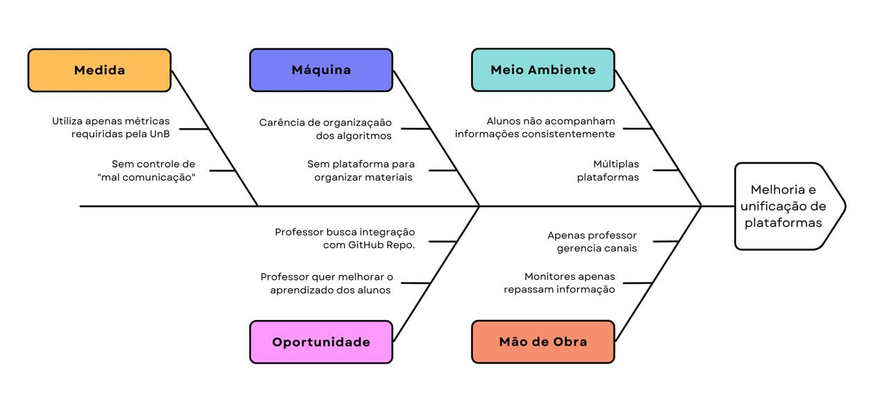

# CENÁRIO ATUAL DO CLIENTE

## Introdução ao Negócio e Contexto

As universidades no Brasil estão passando por uma transformação impulsionada pela digitalização do ensino. Essa transição foi ainda mais motivada durante e pós a pandemia ocorrida em 2020. Os novos métodos adotados demandam a criação de ferramentas de ensino digitais.  

A Universidade de Brasília consolidou suas ferramentas digitais de ensino, utilizando o SIGAA desde 2020 para gerenciar processos acadêmicos e administrativos. Complementarmente, em 2021, a UnB lançou o Aprender3, uma plataforma focada exclusivamente no ensino e aprendizagem, distinta do SIGAA, que abrange funcionalidades mais amplas da gestão universitária.  

Embora funcionais, essas ferramentas enfrentam desafios de estabilidade, muitas vezes demandando um esforço considerável de equipes para manter sua operação fluida. Atualmente, o professor utiliza de uma página do Moodle para compartilhar materiais didáticos, um repositório do GitHub para exemplificar os códigos apresentados, do e-mail institucional da universidade (Outlook) para compartilhar avisos e de um canal do Telegram para contato mais direto com os alunos.  

## Identificação da Oportunidade ou Problema

Diante da necessidade de oferecer recursos mais robustos e específicos para o ensino, foi identificada uma oportunidade: a criação de um site dedicado a uma disciplina específica. O objetivo é desenvolver uma plataforma mais estável e personalizada a um docente, que possa complementar as ferramentas institucionais e aprimorar a experiência de aprendizado para seus alunos. 

O Professor Doutor Maurício Serrano, docente da Universidade de Brasília, atuante na Faculdade de Ciências e Tecnologias de Engenharia (FCTE), é o cliente proposto. O projeto direciona-se aos discentes da faculdade, ingressantes na disciplina de Estruturas de Dados 2. Nos últimos anos, houve um crescimento na busca pela matéria, reflexo do aumento da demanda de estudantes do curso de Engenharia de Software. Logo, uma plataforma que irá auxiliar tantos alunos é de grande valia. 

A disciplina que o professor ministra apresenta fragmentação nos canais de comunicação e falhas na disponibilidade dos materiais didáticos, evidenciadas pela perda de acesso do docente à página institucional e por relatos de alunos sobre atraso e dificuldade para localizar conteúdos. Essa situação aumenta a carga administrativa do professor, compromete a organização das aulas e reduz a efetividade do aprendizado. 

Adicionalmente, o professor Maurício identificou uma oportunidade pedagógica: a possibilidade de incorporar, na solução proposta, recursos específicos de ensino — como apresentações dos algoritmos trabalhados, visualizações passo a passo e exemplos de implementação em diferentes linguagens — com o objetivo de enriquecer a compreensão e os projetos práticos dos alunos. 

Torna-se, portanto, necessária uma solução integrada e acessível que retome a autonomia do professor sobre sua página, simplifique o fluxo de publicação de materiais e viabilize a inclusão e validação dessas funcionalidades pedagógicas, avaliadas por meio de métricas claras (disponibilidade, tempo de publicação, conformidade do material, uso dos recursos pedagógicos e satisfação dos alunos).

## Desafios do Projeto

No momento, o cliente não apontou nenhuma dificuldade ou obstáculo notavelmente prejudicial. Mas, evidentemente, apresentou descontentamento com sua situação prévia e já teve atrasos para o envio de materiais de auxílio, como o plano de ensino, slides didáticos, dentre outros, os quais impactam negativamente no estudo dos alunos. Um desafio quase que certeiro será a definição de métricas para avaliar se o produto estará gerando valor ou não. Outro desafio claro é a agenda do cliente e da equipe, pois tanto o professor encontra-se com diversas atividades das quais necessita de sua atenção, como os próprios integrantes da equipe possuem agendas conflitantes uma com a outra, dificultando a realização de reuniões síncronas. Como restrição, nota-se uma verba bem limitada de "gastar o mínimo possível" e a entrega ser feita anterior ao dia 02/12/2025.  

## Segmentação do Cliente

Há dois perfis de cliente que serão atendidos por este projeto: 

- **Professor:** Pertence ao corpo docente da Universidade de Brasília, e já utiliza ferramentas para a organização e divulgações de informações e materiais didáticos das disciplinas que aplica. Entretanto, apresenta insatisfações com as ferramentas disponibilizadas pela universidade.  
- **Discentes da Universidade de Brasília:** Alunos, especialmente aqueles matriculados na disciplina de Estrutura de Dados 2, que desejam ter acesso às informações da disciplina, para organização, atualização e como material didático de estudo.
