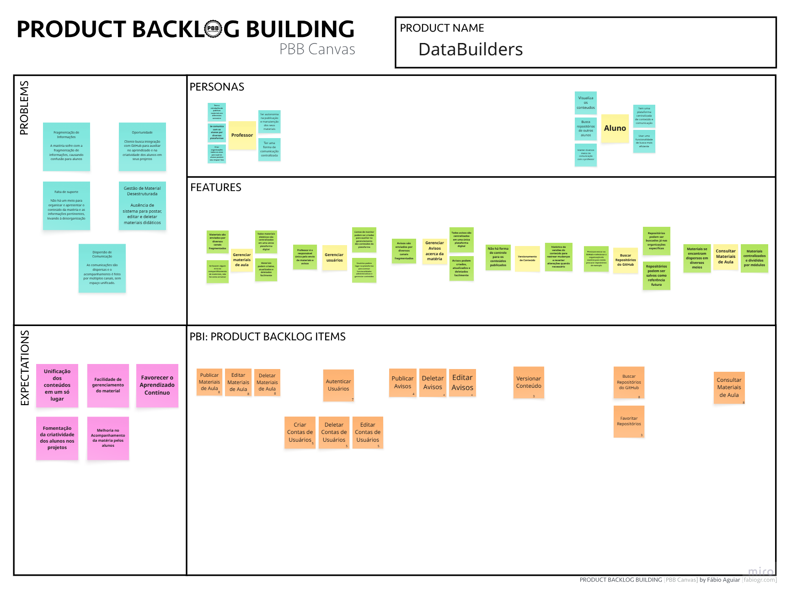

# Product Backlog Building (PBB)

Para organizar as funcionalidades do projeto e transformar necessidades do cliente em requisitos claros, utilizamos o framework **Product Backlog Building (PBB)**. Esse framework permitiu compreender o fluxo de valor do produto, mapear atividades essenciais e identificar todas as ações dos usuários dentro do sistema.

A partir do PBB, foi possível gerar uma **lista estruturada de histórias de usuário**, representando cada funcionalidade necessária para atender aos diferentes perfis envolvidos no produto.

---

## PBB do Projeto

[Acesse o PBB no Miro](https://miro.com/app/board/uXjVJDF_XEY=/?moveToWidget=3458764650708270156&cot=14)

# Priorização COORG

Após a construção das histórias de usuário, aplicamos o método **COORG** para definir quais funcionalidades seriam implementadas no **MVP (Minimum Viable Product)**.  
O COORG é uma técnica de classificação que permite priorizar itens do backlog com base em critérios objetivos e alinhados às necessidades do negócio.

Para este projeto, utilizamos os seguintes critérios:

---

## 1. Frequência de Uso (peso máximo: 5)

| Categoria     | Peso | Descrição |
|---------------|------|-----------|
| **HORA A HORA** | 5 | Funcionalidade utilizada diversas vezes ao dia. |
| **DIÁRIO**      | 4 | Utilizada pelo menos uma vez ao dia. |
| **SEMANAL**     | 3 | Utilizada de uma a três vezes na semana. |
| **MENSAL**      | 2 | Utilizada uma vez ou pouco mais por mês. |
| **TRIMESTRAL**  | 1 | Utilizada pelo menos uma vez a cada três meses. |

---

## 2. Valor de Negócio (peso máximo: 3)

| Categoria | Peso | Descrição |
|----------|------|-----------|
| **ALTO**   | 3 | Muito importante, gera grande impacto e valor imediato. |
| **MÉDIO**  | 2 | Possui relevância moderada. |
| **BAIXO**  | 1 | Contribui pouco no momento atual. |

---

## Como foi feita a priorização

Cada PBI gerada no PBB recebeu uma pontuação total resultante da soma dos critérios: Frequência de Uso + Valor de Negócio

Essa análise permitiu identificar quais funcionalidades trazem maior impacto e são utilizadas com maior frequência pelos usuários do sistema.

### 📌 Regra para definição do MVP

✔ **Entravam no MVP apenas as histórias com pontuação acima de 4.**

Essa regra garantiu que o MVP incluísse:

- as funcionalidades mais urgentes e frequentes;  
- as de maior impacto no valor entregue ao cliente;  
- e aquelas essenciais para o funcionamento inicial do sistema.

A priorização COORG ajudou a direcionar esforços da equipe para entregar rapidamente um produto funcional, útil e alinhado às necessidades principais do usuário.

---
