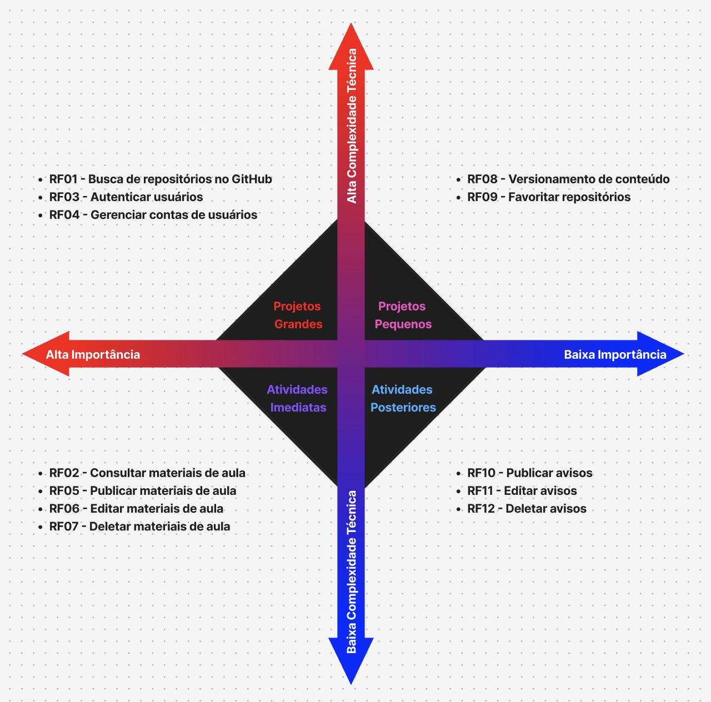

# Product Backlog – Data Builders

O **Product Backlog** é uma lista priorizada de todas as funcionalidades, melhorias e requisitos que devem ser implementados no sistema, servindo como guia para o planejamento e execução do desenvolvimento.  

As funcionalidades estão organizadas segundo o método **MoSCoW**, que define prioridades de forma clara:  

- **Must Have**: funcionalidades essenciais para o MVP (produto mínimo viável).  
- **Should Have**: funcionalidades importantes, mas não críticas para o MVP.  
- **Could Have**: funcionalidades desejáveis, mas que podem ser implementadas posteriormente.  
- **Won’t Have**: funcionalidades que não farão parte do escopo atual.  

O objetivo desta página é fornecer à equipe uma visão clara das prioridades do projeto, ajudando todos a se manterem alinhados quanto às entregas, ao planejamento do MVP e às decisões de desenvolvimento, garantindo que o esforço esteja sempre focado nas funcionalidades mais relevantes para o sucesso do produto.

Nota-se que os objetivos específicos foram previamente listados na página "Solução", na qual foram melhor detalhados. Mas, reforçando, tais objetivos se resumem a:

- **OE1**: Autonomia e disponibilidade da página para usuários
- **OE2**: Postagem e fornecimento de materiais de aula
- **OE3**: Integridade do material e apresentação de códigos exemplares

| Objetivo Específico | ID   |  RF   | Descrição                     | Prioridade      | MVP |
| ------------------- | ---- |  ---- | ----------------------------- | --------------- | --- |
| OE3                 | US01 |  RF01 | Buscar Repositórios do GitHub | **Must Have**   | ✅   |
| OE2                 | US02 |  RF02 | Consultar Materiais de Aula   | **Must Have**   | ✅   |
| OE1                 | US03 |  RF03 | Autenticar Usuários           | **Must Have**   | ✅   |
| OE1                 | US04 |  RF04 | Criar Contas de Usuários      | **Should Have** | ✅   |
| OE1                 | US05 |  RF05 | Editar Contas de Usuários     | **Should Have** | ✅   |
| OE1                 | US06 |  RF06 | Deletar Contas de Usuários    | **Should Have** | ✅   |
| OE2                 | US07 |  RF07 | Publicar Materiais de Aula    | **Must Have**   | ✅   |
| OE2                 | US08 |  RF08 | Editar Materiais de Aula      | **Must Have**   | ✅   |
| OE2                 | US09 |  RF09 | Deletar Materiais de Aula     | **Must Have**   | ✅   |
| OE2                 | US10 |  RF10 | Versionar Conteúdo            | **Should Have** |     |
| OE1                 | US11 |  RF11 | Favoritar Repositórios        | **Should Have** |     |
| OE3                 | US12 |  RF12 | Publicar Avisos               | **Could Have**  |     |
| OE3                 | US13 |  RF13 | Editar Avisos                 | **Could Have**  |     |
| OE3                 | US14 |  RF14 | Deletar Avisos                | **Could Have**  |     |
| —                   | —    |  —    | (nenhuma descartada ainda)    | **Won’t Have**  |     |

---

### Complexidade

Para auxiliar na construção da tabela MoSCoW, foi estabelecido uma matriz de complexidade no [**Figma**](https://www.figma.com/board/Kw9DsJ4TlWcCwdi1I62q7I/Sem-t%C3%ADtulo?node-id=0-1&t=RC2qap7qIVX463fv-1), aonde a equipe debateu sobre o conhecimento dos membros acerca das tecnlogias utilizadas e das funcionalidades a serem implementadas. Desse debate, surgiu a ideia de "alta complexidade" e "baixa complexidade". "Alta complexidade" é uma feature cuja implementação e tecnologias associadas ou não são de conhecimento prévio da equipe de desenvolviemnto ou são consideradas trabalhosas (três dias ou mais de produção). "Baixa complexidade" é oposto, são de implementação e tecnologia conhecida, podendo rapidamente ser produzidas (em torno de um dia).

---

#### Acesse a Matriz de Complexidade

**[Clique aqui para visualizar a matriz no Figma](https://www.figma.com/board/Kw9DsJ4TlWcCwdi1I62q7I/Sem-t%C3%ADtulo?node-id=0-1&t=RC2qap7qIVX463fv-1)**  

---

