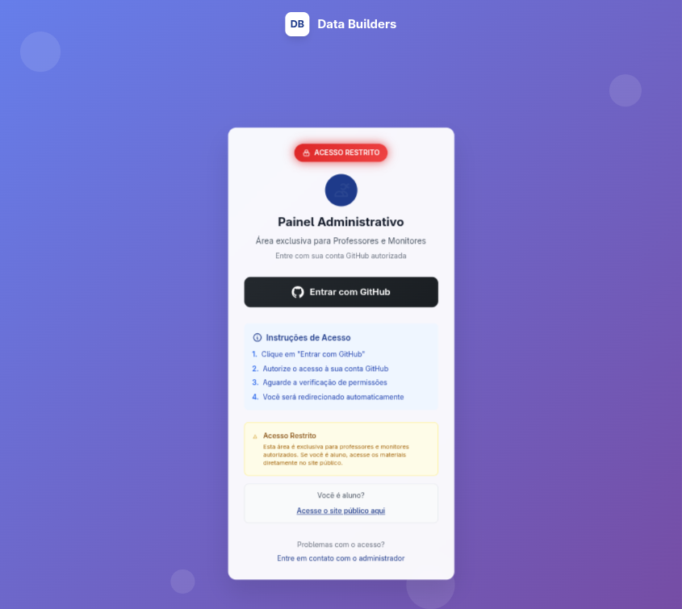
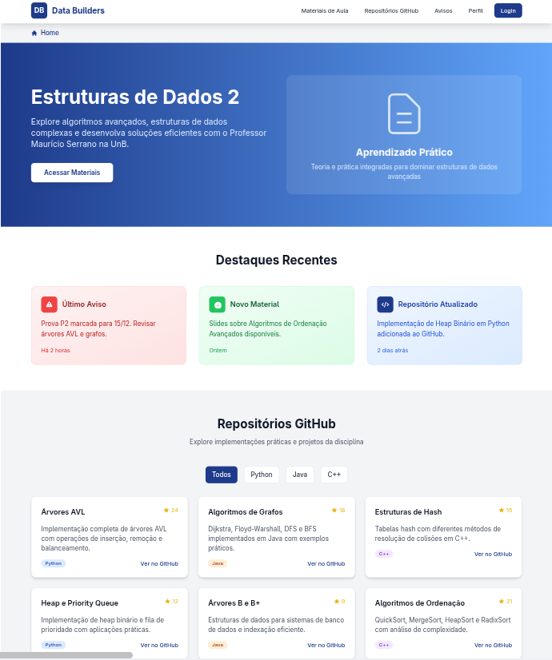
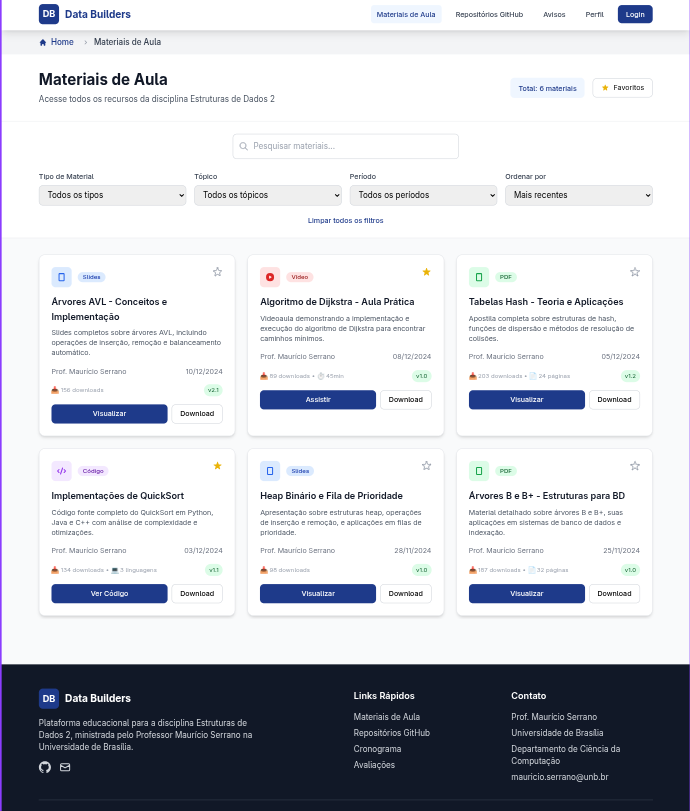
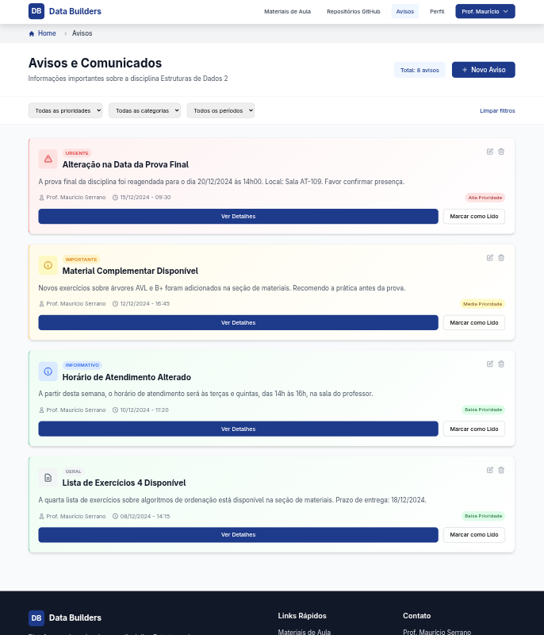
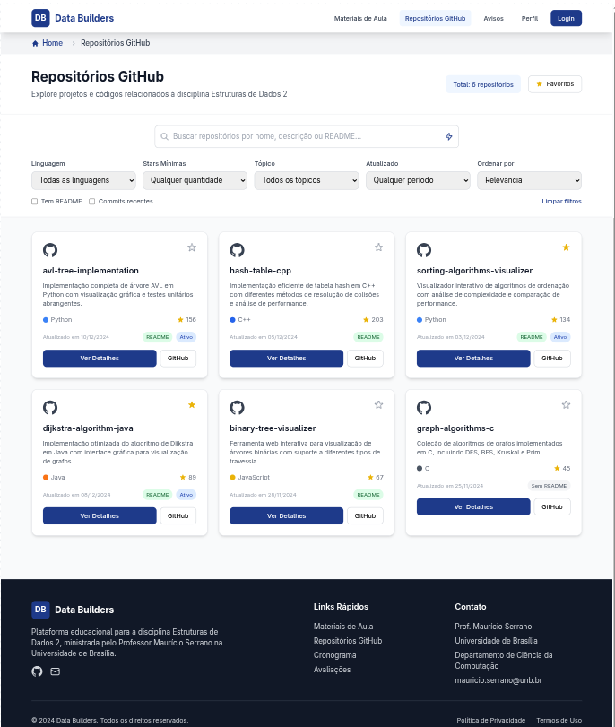
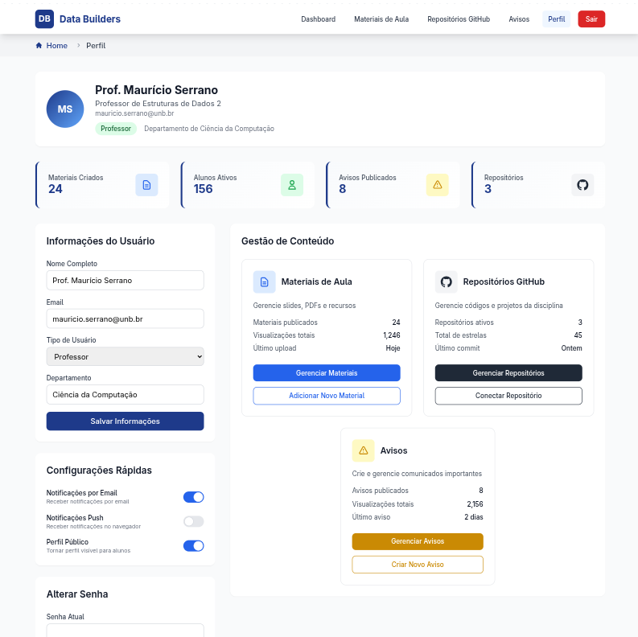
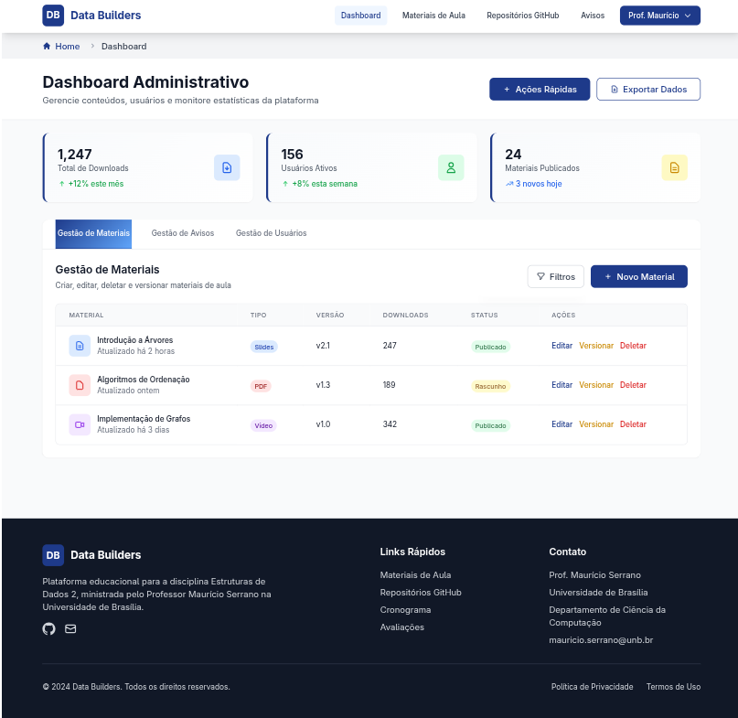

# 🎨 Protótipo do Projeto **Data Builders**

O protótipo foi desenvolvido no [**Canva**](https://www.canva.com/design/DAG09_P-IgA/sm5cShx0aAElzWhkf546ew/view?utm_content=DAG09_P-IgA&utm_campaign=designshare&utm_medium=link2&utm_source=uniquelinks&utlId=hf45083ee4e) e representa a estrutura inicial do site proposto para a disciplina **Estruturas de Dados 2**, ministrada pelo **Professor Doutor Maurício Serrano** na **Universidade de Brasília**.

---

## 🧩 Objetivo do Protótipo

O protótipo tem como objetivo **demonstrar o fluxo de navegação, a identidade visual e a disposição dos elementos principais** do sistema antes da implementação.  
Ele serve como base para validar ideias, coletar feedback e garantir que o produto final atenda às necessidades do professor e dos alunos.

---

## 🔗 Acesse o Protótipo

👉 **[Clique aqui para visualizar o protótipo completo no Canva](https://www.canva.com/design/DAG09_P-IgA/sm5cShx0aAElzWhkf546ew/view?utm_content=DAG09_P-IgA&utm_campaign=designshare&utm_medium=link2&utm_source=uniquelinks&utlId=hf45083ee4e)**  

---

## 🖥️ Telas e Funcionalidades

| Página | Descrição |
|--------|------------|
| **Login (Professor/Monitores)** | Área exclusiva de login para professor e monitores. |
| **Página Inicial** | Apresenta o projeto, com links diretos para as principais áreas do site. |
| **Materiais de Aula** | Espaço dedicado a vídeos, slides e documentos da disciplina. |
| **Repositórios GitHub** | Exibe projetos da disciplina com filtros, busca e integração à API do GitHub. |
| **Avisos e Comunicados** | Central de mensagens e comunicados do professor e monitores. |
| **Perfil e Gestão** | Página para alterar dados pessoais e para gerenciar e adicionar conteúdos |
| **Dashboard Administrativo** | Dashboard de gerenciamento de materiais, avisos, repositórios e usuários |

---

## 🎯 Importância do Protótipo

O protótipo é uma etapa fundamental do desenvolvimento, pois:

- Garante **clareza na comunicação** entre equipe e cliente;  
- Permite **testar a experiência do usuário (UX)** antes da codificação;  
- Reduz **retrabalho** e **ajustes futuros**;  
- Facilita a **visualização da identidade visual e do layout**.  

---

## 🧠 Tecnologias Planejadas

> O projeto final será desenvolvido com foco em:
>
> - **Front-end:** React
> - **Back-end:** Node.js + TypeScript  
> - **Banco de Dados:** PostgreSQL ou MongoDB  
> - **Integrações:** GitHub API

---

## 📸 Prévia Visual

### Tela de Login

### Tela da Home Page

### Tela de Materiais

### Tela de Avisos

### Tela de Repositórios

### Tela de Perfil

### Tela de Dashboard Administrativo

---

> _“Um bom protótipo é o primeiro passo para um produto funcional e bem estruturado.”_
